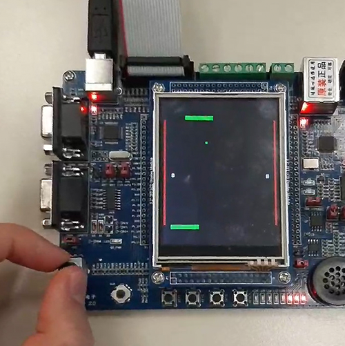

The classic Pong game on the LandTiger LPC17XX boards. \
Developed for the Computer Architecture course at Politecnico di Torino.

The project was developed for a LPC1768 emulator and then adapted for the physical board.

  

The user controls the paddle via the potentiometer. The peripherical non-ideality is taken into account.

## Note
The libraries to interface with the board are not developed by me.
